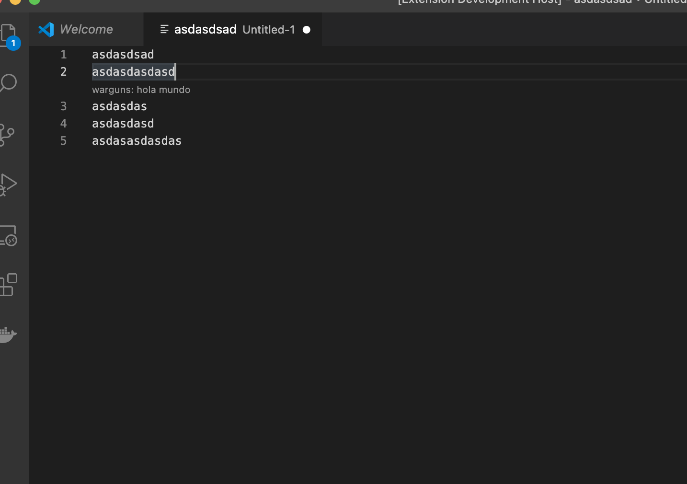

# Twitch Code Reviewers 

Make your twitch followers add reviews on your code during your code Stream, the plan is use Socket.io to connect it

# How to make it work:

1. Run a local socket.io server (default port 666), cd to src/server and run node index.js
2. emit using the format: `socket.broadcast.emit('twitch-code-review', user, folderName, line, message);` you can see an example on http://localhost:666/emit.html

example params: 
user = "@warguns"
folderName = "Untitled-1"
line = 22
message = "hola"

## Debugging the Extension

- Run `npm install` in terminal to install dependencies
- Run `npm run compile` to compile extension
- Go to `out` folder and press `F5` to run debugger
- Run the `Run Extension` target in the Debug View. This will:
	- Start a task `npm: watch` to compile the code
	- Run the extension in a new VS Code window